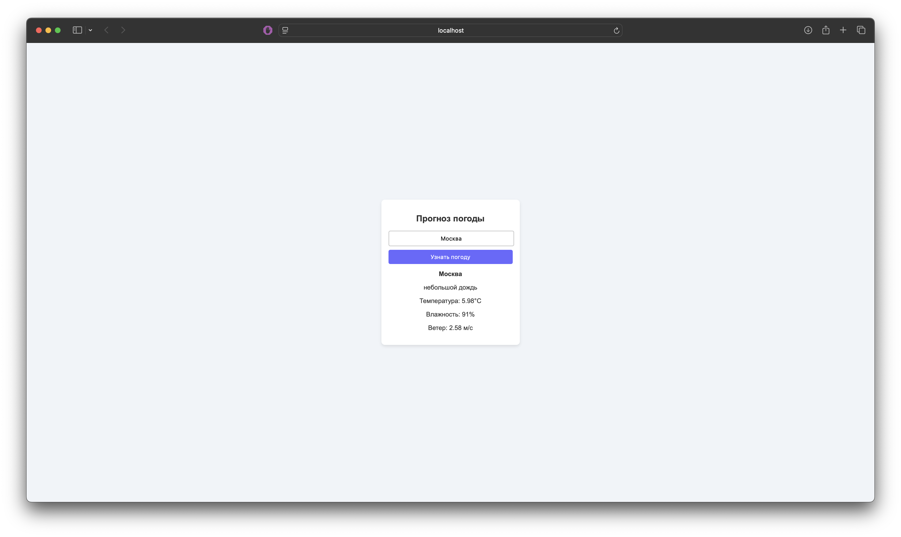

# Шаблон приложения для отображения погоды

Это шаблон приложения, которое позволяет отображать информацию о погоде с использованием API OpenWeather.

## Требования

Для работы потребуется ключ API OpenWeather

## Запуск через Makefile

```bash
make run
```

## Пример работы:

